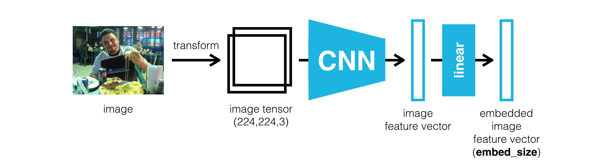
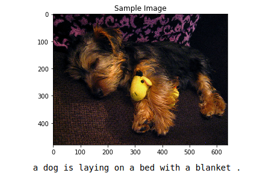

# Image captioning

## Project Overview

This project was done during passing Computer Vision Nanodegree in Udacity. Build and train a CNN-RNN model which extracts features from image using CNN encoder and converts them into text using RNN decoder.

## Architecture

Network architecture:

### Encoder:

Encoder consistis of pre-trained ResNet-50 and following Embedding layer. ResNet-50 is a convolutional neural network whih is trained on more that a million images from ImageNet dataset. Embedding layer is used for co-embedding images and sentences together.

### Decoder:

Decoder consists of single LSTM layer followed by fully-connected layer.

## Files

Repository contains next files:

* [0_Dataset](./0_Dataset.ipynb) - Dataset overview
* [1_Preliminaries](./1_Preliminaries.ipynb) - Loading and pre-processing data
* [2_Training](./2_Training.ipynb) - Training network
* [3_Inference](./3_Inference.ipynb) - Obtaining results from trained network
* [data_loader.py](data_loader.py) - Custom data loader
* [vocabulary.py](./vocabulary.py) - Vocabulary class which constructs vocabulary from the captions in the training dataset
* [workspace-utils.py](./workspace-utils.py) - Util methods for keeping udacity workspace awake
* [images](./images) - Images used in notebook and this readme
* [models](./models) - Contains weights for trained models

## Evaluation

Repository contains weights for trained encoder and decoder. Evalution process can be executed using [this](./3_Inference.ipynb) notebook.

## Resources

* [Dataset details](https://cocodataset.org)
* [Research paper](https://arxiv.org/pdf/1411.4555.pdf)

## Results

As a result I obtained a neural network which can generate text description of image file.

